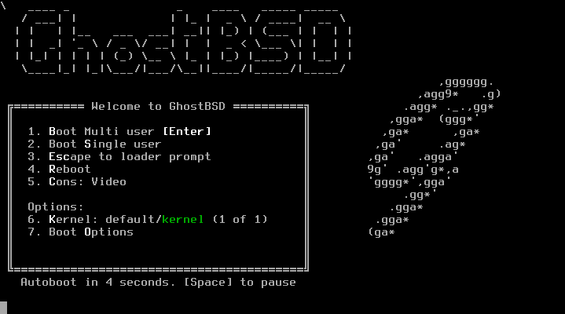
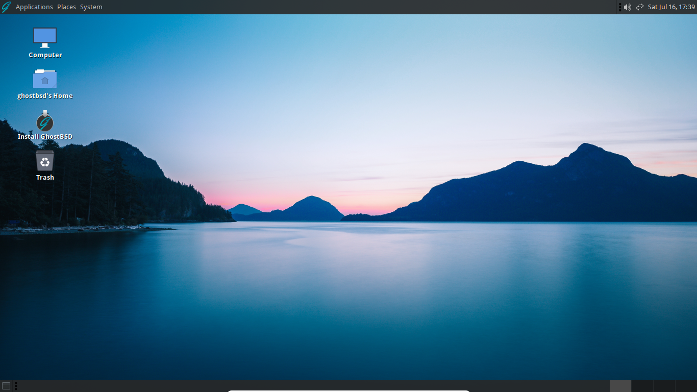
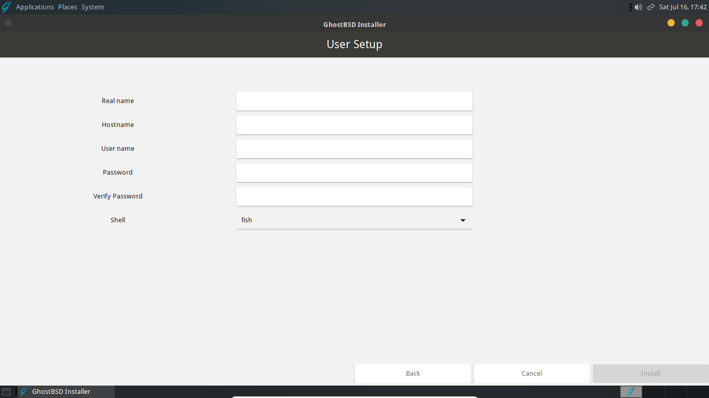
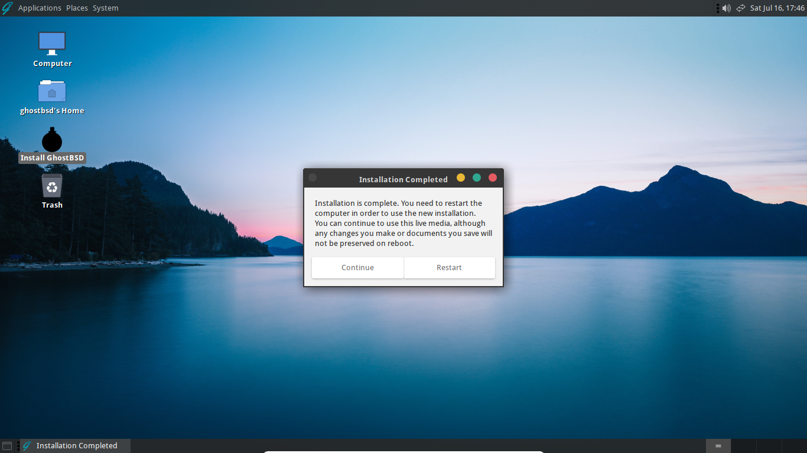

Full disk installation
======================

## Starting the GhostBSD live system

Insert the GhostBSD flash drive and reboot or turn on the computer. Before the computer boots an existing OS it is necessary to select the flash drive as the boot device. This can be done by:

* Entering the computer's BIOS or UEFI interface and selecting the flash drive.
* Pressing a designated key to choose the boot device and selecting the flash drive.

The keys to enter the BOIS or UEFI interface or select boot devices vary between motherboards. The proper key may be displayed during the boot process and is often *Del*, *Esc*, or *F1* through *F12*.

If the computer boots into an existing OS, it may mean:

* The flash drive was not properly inserted.
* The BIOS or UEFI changes were not saved.
* The computer does not support booting from the desired device.
* The proper key was not pressed, or pressed at the correct time, during the boot process.
* There was an error while creating the live flash drive.

As GhostBSD boots, the loader menu will appear and will look similar to one of the images below depending if the system is booted in UEFI or BIOS mode.

GhostBSD will finish booting and will automatically load the Mate desktop environment.

## Using the live system

It is possible to use this live system to test hardware compatibility or to become familiar with basic GhostBSD features and default software.

## Installing GhostBSD

### Starting the installer

Double click the "Install GhostBSD" desktop icon to start the installer. A new window will appear with the following screens to setup and install a GhostBSD system. To save changes and proceed through the installation, click "Next". You may click "Previous" to return to the previous screen and make additional changes. Click "Cancel" or the red circle (top right corner) to exit the installer.

### Localization

#### Language

Select the language you would like to use for your installed system. If you need to change the system language after installation, more information about localization can be found in the [FreeBSD Handbook](https://docs.freebsd.org/en/books/handbook/l10n/).

**Please note**: Currently, the installer only supports English during the installation process.

#### Keyboard

You may select a keyboard layout specific to your language or region. It is also possible to specify the model of keyboard. If you do not know the model of your keyboard, or it is not listed, you should simply click "Next" without making a selection.

#### Time zone

Select your time zone to allow the system to adjust to regional time changes and properly perform other time zone related functions.

### Disks and filesystem

#### Installation type

Select *Full disk configuration* to install GhostBSD with the default ZFS configuration. It is possible to use other filesystems and partitioning schemes by selecting *Custom (Advanced partitioning)*.

#### Installation disk

Select the disk where GhostBSD should be installed by clicking the corresponding checkbox. There are additional ZFS options that may be changed from this screen. However, the default values are generally appropriate for most users and systems.

**Please note**: The selected disk will be formatted during the installation and any existing data will be lost.

### Boot loader

By default, GhostBSD uses the native FreeBSD boot loader. If you plan to use multiple operating systems from a single machine, it may be convenient to choose rEFInd rather than the default. rEFInd can detect other operating systems and chainload their respective, native boot loaders. This can remove the need to override the boot device as described previously in [Booting from the GhostBSD flash drive](#booting-from-the-ghostbsd-flash-drive).

**Please note**: If the live system was booted in UEFI mode, the installer will show "FreeBSD *UEFI* loader only". If booted in BIOS mode, the installer will show "FreeBSD *BIOS* loader only".

### Root password

Unix-like operating systems have an administrative user called root. Root has the ability to make any change to the system or users. Therefore, it is necessary to create a strong password for root. Any password can be used but the installer will suggest if it is weak or strong.

### Adding a user

Create your user by entering a *Real name*, *User name*, and *Password*. The installer will again suggest whether the password is weak or strong. The *Hostname* is the name of your computer that is displayed on any networks. It will be automatically created but can be changed if desired. The *Shell* is what you interact with when using the terminal (command line). GhostBSD aims provides a user-friendly GUI experience and it is not often required to use the terminal. The default shell is fish, however, several others are included.
 ### Finish and reboot #### Progress screen
After a user is created, click "Install" to complete the installation. A progress screen will appear that shows the actions being performed and other messages.

#### Reboot into new installation

If the installation is successful, the below screen will be displayed. Click "Continue" to remain in the live system or click "Restart" to reboot into the newly installed GhostBSD system. Be sure remove the flash drive after the computer shuts down but before it restarts. Some machines may automatically boot from an attached live flash drive.

