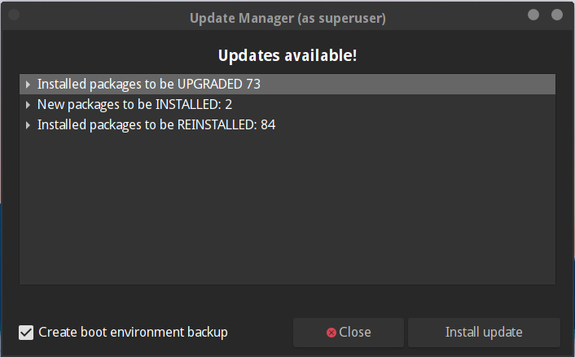
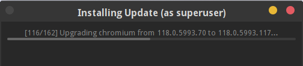
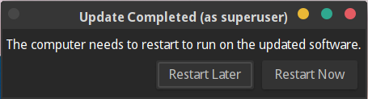

Upgrading GhostBSD Guide
========================

```{contents} Table of Contents
:depth: 3
:local:
```

## Synopsis
GhostBSD is under constant development and keeps in sync with the latest FreeBSD stable developments source code. However, upgrading GhostBSD to FreeBSD is not an option. GhostBSD provides Update Station to keep the system and all software up-to-date and allows easy upgrades between system versions. GhostBSD is a slow-rolling release meaning GhostBSD offers a stable release cycle and version increments on every system or software package build. This guide describes how to keep GhostBSD up-to-date.

After reading this build, you will know the following:
* How to keep a GhostBSD system up-to-date with Update Station.
* How to keep a GhostBSD system up-to-date with pkg cli.

## GhostBSD upgrade with Update Station
Applying security patches promptly and upgrading to a newer release of an operating system are important aspects of ongoing system administration. GhostBSD includes a GUI utility called Update Station, which performs both tasks.

Update Station uses FreeBSD pkg to perform system and software updates, which have been made to update/upgrade GhostBSD properly. GhostBSD upgrades its base system using packages. Update Station will always upgrade you to the latest system and packages. If there is a kernel upgrade, it will reinstall all packages to ensure that there are no kernel mismatch issues with drivers and some software.

This section demonstrates how to upgrade to the latest version and discusses some of the considerations when upgrading the operating system.

### Update notification
On GhostBSD, you will receive a notification in the notification area, an orange icon will be visible when new software or system updates are available. Left Click on the icon, and a Window will opne with the list of software and OS packages that will be upgraded.

{.bg-primary align=center}

### Before upgrading
On the Upgrade list, a checkbox at the bottom is enabled by default to create a boot environment backup before the upgrade. It is recommended to keep it enabled in case an issue happens with the upgrade. With a BE backup the system can be restored to the stat it was before the upgrade was perform.

{.bg-primary align=center}

### Starting the upgrade
Click Install Upgrade to start the upgrade.

{.bg-primary align=center}

### Update progress
A window with a progress bar will appear.

{.bg-primary align=center}

### Upgrade completed
After the upgrade is complete Update Station will be ask to restart the system if needed.

{.bg-primary align=center}

## GhostBSD upgrade with pkg cli
Upgrading packages with pkg has to be done in a specific way, specifically with OS upgrade.

### Before upgrading
Before upgrading with pkg make sure to backup the system boot environment with **bectl**. It is recommended to backup the system boot environment in case an issue happens with the upgrade. With a BE backup the system can be restored to the stat it was before the upgrade was perform.

Here is an example on how to create BE.
```bash
ericbsd@ericbsed-ghostbsd-pc ~> sudo bectl create upgrade-November-02-2023
Password:
ericbsd@ericbsed-ghostbsd-pc ~> sudo bectl list
BE                       Active Mountpoint Space Created
backup-2023-11-02-20-05  -      -          68.5M 2023-11-02 20:05
backup-2023-11-02-20-14  -      -          109M  2023-11-02 20:14
initial                  NR     /          122G  2021-02-27 14:36
new                      -      -          44.4G 2023-05-22 15:18
upgrade-November-02-2023 -      -          1.07M 2023-11-02 20:50
ericbsd@ericbsed-ghostbsd-pc ~>
```

### Determining how to upgrade
To determine how to upgrade packages with pkg, run **sudo pkg update -f** it will know if there is kernel mismatch.

```bash
> sudo pkg update -f
Updating GhostBSD repository catalogue...
pkg: Repository GhostBSD has a wrong packagesite, need to re-create database
Fetching meta.conf: 100%    163 B   0.2kB/s    00:01
Fetching packagesite.pkg: 100%    7 MiB   6.9MB/s    00:01
Processing entries:   0%
Newer FreeBSD version for package ztrack:
To ignore this error set IGNORE_OSVERSION=yes
- package: 1302505
- running kernel: 1301510
Ignore the mismatch and continue? [y/N]:
```

If a similar message than the above one is encounter, **sudo pkg upgrade -f** must be use to upgrade all installed packages or some problem could occur after rebooting. If **sudo pkg update -f** doesn't report kernel mismatch, **sudo pkg upgrade** can be used to upgrade packages.

### Starting the upgrade
Run the command below if there is a kernel mismatch with **update -f**.
```
sudo pkg upgrade -f
```
Run the command below if there no kernel mismatch with **update -f**.
```
sudo pkg upgrade
```

### After the upgrade
In most cases the system will need to be restarted after an upgrade.

## Troubleshooting

**[Content coming soon]**
