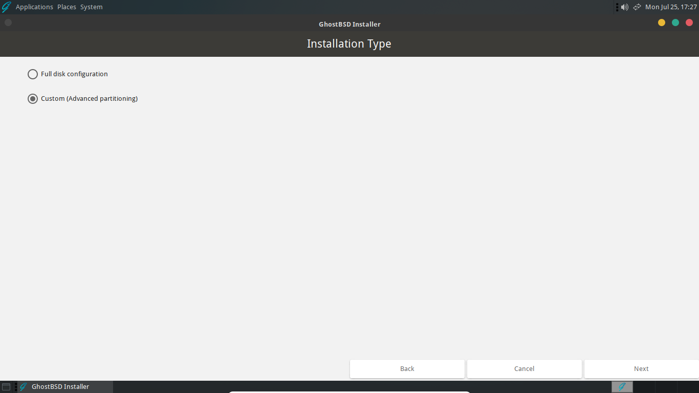
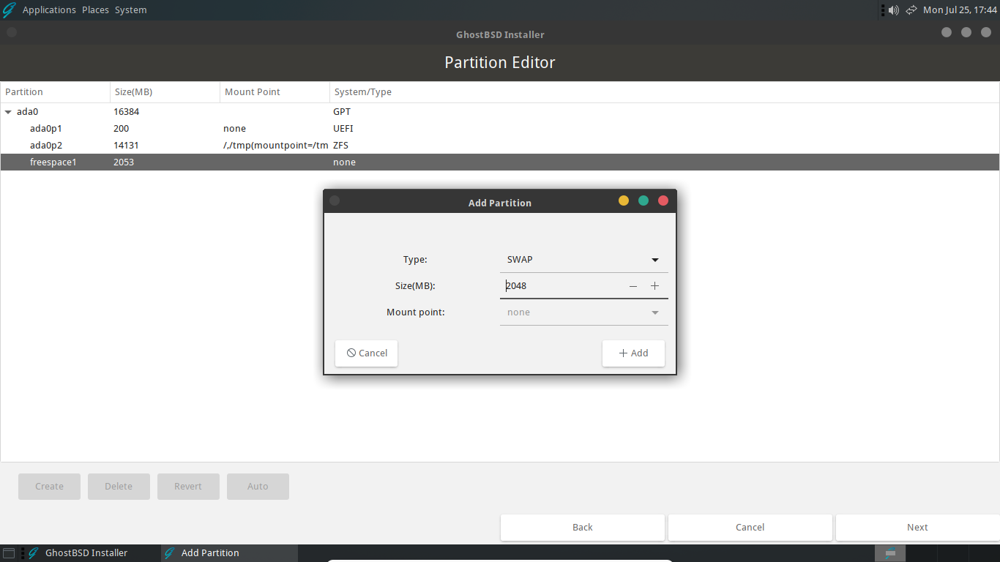

Custom Installation
===================

A custom installation and full disk installation of GhostBSD begin the same way. Please follow the [Full disk installation](full-disk-installation.md) guide until the *Disks and filesystem* section. When that section is reached, follow this guide to complete the custom installation.

The purpose of this guide is not to provide the steps for every possible configuration, but to provide some background to help with custom partitioning and filesystem layouts. The [Installing GhostBSD](#installing-ghostbsd) section has the steps needed for a custom installation with the recommended setup using UEFI, GPT and OpenZFS.

## Partitioning schemes

There are two partitioning schemes available in GhostBSD that are used to divide a disk into sections called slices or partitions. There is the Master Boot Record (MBR) layout and the GUID Partition Table (GPT) layout. Generally, MBR disks are used if the machine boots with the legacy Basic Input/Output System (BIOS) and GPT disks are used when booting with the newer Unified Extensible Firmware Interface (UEFI). UEFI can boot from a GPT or MBR disk and in some machines there is compatibility code that allows BIOS to boot from GPT disks, in addition to, MBR disks.[^1]

### MBR

There are several limitations when using the older MBR layout including limits on the size of the disk and number of partitions that are possible. MBR only officially supports disks that are up to two terabytes. There is also a limit of four primary partitions but an extended partition may be used to increase this number.[^2] 

### GPT

GPT is a newer partitioning scheme created by Intel&reg; as part of the EFI specification designed to replace MBR and BIOS. GPT identifies partitions using globally unique identifiers (GUIDs), also known as universally unique identifiers (UUIDs). The advantages of GPT include support for larger disks and no partition limits. The supported sizes for GPT disks can range from about 9 to 75 zettabytes.[^1]

## File systems

There are two file systems that can be used to install GhostBSD, the UNIX&reg; file system (UFS) and ZFS&reg; (previously the Zettabyte file system).

### UFS

UFS is derived from the original filesystem used in Version 7 UNIX. During its long history there have been two versions (UFS1 and UFS2), improvements, and features added. In the GhostBSD installer, there are options to use UFS2 with or without journaling and soft updates. These features can create a more robust system to better handle crashes and provide a snapshot ability.[^3] On average, UFS may require fewer resources than OpenZFS, but on most modern computers this should not typically be of concern.

### OpenZFS

ZFS is a modern filesystem first created as part of the Solaris&reg; operating system. Solaris and ZFS were released under open source licenses for a brief time. Eventually, both were placed back under closed source licenses. Prior to the license changes, ZFS was forked and developed by the open source community and is now used in various operating systems as OpenZFS.[^4] There are numerous benefits to using OpenZFS, such as, error checking, data compression and file system snapshots.[^5]

## Installing GhostBSD

Select *Custom (Advanced partitioning)* and click "Next" to start the Partition Editor.

### Partition Scheme

:::{important}
It's possible that the disk will already have a partitioning scheme shown under the "System/Type" field in the Partition Editor. If this is the case, you can skip this step and proceed to the *Creating partitions* section below.
:::

In the Partition Editor you will see the disks that are available.

Select the disk you want to install to and click "Create" to choose a partition scheme.

After choosing the desired partitioning scheme, click "+ Add" to create that layout on the selected disk. The result should look similar to the image below.

### Creating partitions

The default installation of GhostBSD will create three partitions. These are boot, root, and swap. There are a variety of different configurations including omitting swap or placing /home, /usr, or /var on their own partitions or disks. These variations can also involve using either UFS or OpenZFS on GPT or MBR partitioned disks with machines that are booted with BIOS or UEFI. The example below will manually create a layout that is similar the default installation. It will use OpenZFS on a GPT disk with a machine that is booted with UEFI.

#### Boot partition

The first partition to create is the boot partition. Select the free space under the disk label, here these values are "freespace1" and "ada0". Then, click "Create" to open the "Add a Partition" dialog. Select "UEFI" and change the size. Here were are using 200MB. Click "+ Add" to create the UEFI partition.

#### Root partition

Next create the OpenZFS root partition. Again, select the free space and click "Create". In the "Add a Partition" dialog, select "ZFS" and enter the desired size of the partition. Click "+ Add" to create the OpenZFS root partition. The installer will automatically assign the correct mount points for the partition.

:::{important}
It is necessary to account for the size of the swap partition (if using one) and a small amount of unallocated storage at the end of the disk. This section is required for the GPT table and proper alignment of the sectors on the disk. The default installation leaves about 5MB unallocated. 
:::

#### Swap Partition

The final partition to create is for swap. Depending on you needs and the amount of RAM in the computer this partition can be omitted. Generally, a few GB for swap is helpful in the event that the computer exceeds the amount RAM installed.

In the same manner as the previous partition, select the free space and Click "Create". In the "Add a Partition" dialog make sure "SWAP" is selected, allocate the desired amount of swap and click "+ Add" to create the partition.

#### Finishing the installation

After the above steps, the disk should be partitioned in a similar format as below. Simply click "Next" to proceed with the rest of the installation as described in the [Full disk installation](full-disk-installation.md) guide starting with the *Boot loader* section.

[^1]: Roderick Smith, "Make the most of large drives with GPT and Linux," IBM, https://developer.ibm.com/tutorials/l-gpt/ (July 3, 2012).

[^2]: Joe Keeley, "MBR vs. GPT: Which Should You Use for Your SSD?," MakeUseOf, https://www.makeuseof.com/tag/mbr-vs-gpt/ (April 5, 2022).

[^3]: Wikipedia contributors, "Unix File System," Wikipedia, The Free Encyclopedia, https://en.wikipedia.org/w/index.php?title=Unix_File_System&oldid=1100924136 (accessed July 31, 2022).

[^4]: Michael Dexter, "ZFS vs. OpenZFS," TrueNas, https://www.truenas.com/blog/zfs-vs-openzfs/ (June 18, 2019).

[^5]: "Main Page," OpenZFS, https://openzfs.org/wiki/Main_Page (July 19, 2022).